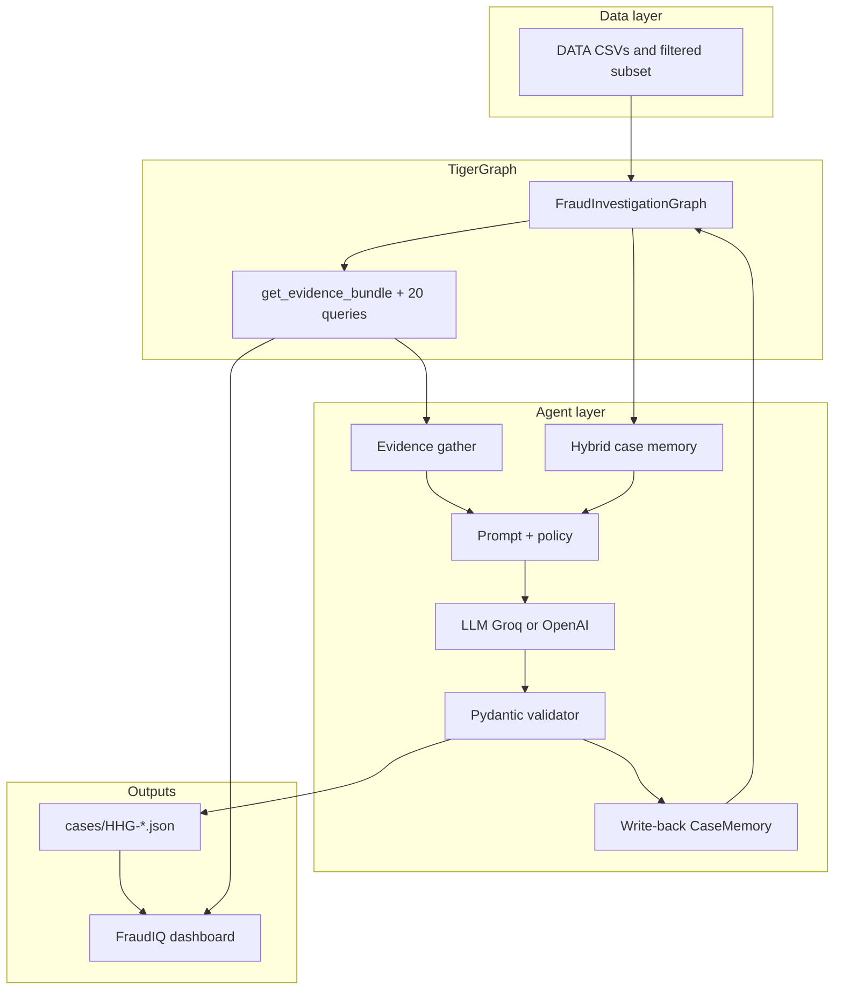

# Agentic Fraud Investigation

An end-to-end **GraphRAG** system for the TigerGraph Hacker House (IEEE-CIS edition): load card and case history into **TigerGraph**, investigate **20 exam alerts** (`HHG-001` … `HHG-020`) with a policy-aware Python agent, write scored **answer JSON**, persist **case memory** back to the graph, and explore results in the **FraudIQ** dashboard.

---

## What problem this solves

Banks receive alerts (risk scores, customer reports, analyst requests). An investigator must decide whether activity is fraud, name the **pattern**, measure **exposure for this case only**, file a **SAR** when regulation and internal policy require it, and recommend **next actions** with the correct approver (`auto`, `L1`, or `L2`).

This repo implements that workflow as software:

1. **Graph** — customers, cards, transactions, devices, regions, and thousands of **closed cases** as a queryable network.
2. **Agent** — retrieves evidence *before* the LLM runs; the model never queries the database directly.
3. **Validator** — enforces fraud policy rules, drops invented IDs, and keeps SAR and actions consistent.
4. **Dashboard** — turns each answer file into evidence, timeline, actions, SAR, and an interactive graph view.

Full exam rules, answer schema, and fraud policy live in [`DATA/readme.md`](DATA/readme.md).

---

## Architecture at a glance



**Memory loop:** after a case closes, the agent can write **ClosedCase** + **CaseMemory** into the graph. The next investigation retrieves similar past cases (graph + optional vector search) and injects them into the prompt as *Relevant Previous Investigations*.

---

## Repository tour

```
Agentic_Fraud_Investigation/
├── DATA/                 # Task spec, case pack, history, filtered load files
├── graph/                # GSQL schema, loaders, queries, deploy scripts
├── agent/                # Investigator, memory pipeline, policy, tests
├── cases/                # Exam deliverables: one JSON per HHG case
├── dashboard/            # FraudIQ — Vite + React UI
├── Scripts/              # ETL, memory bootstrap, dashboard export, validation
├── deployment_report.md  # Last successful TG load snapshot
└── README.md             # You are here
```

| Path | What it does | Deep dive |
|------|----------------|-----------|
| [`DATA/`](DATA/) | IEEE-CIS-style transactions, identity, **case_pack** (20 alerts), **closed_cases_history** (5,565 past investigations). Filtered CSVs under `filtered_data/` are what the graph loads. | [`DATA/readme.md`](DATA/readme.md) |
| [`graph/`](graph/) | **FraudInvestigationGraph**: vertices, edges, loading jobs, fraud/similarity/evidence queries. | [`graph/README.md`](graph/README.md) |
| [`agent/`](agent/) | `agent.py` orchestrates evidence → memory → LLM → validation → file + optional graph write-back. | [`agent/README.md`](agent/README.md) |
| [`cases/`](cases/) | Final agent output per case (`HHG-001.json` … `HHG-020.json`). | Schema in `agent/prompts.py`, `agent/output_models.py` |
| [`dashboard/`](dashboard/) | **FraudIQ**: case list, detail tabs, force-directed graph. | [`dashboard/README.md`](dashboard/README.md) |
| [`Scripts/`](Scripts/) | Build filtered data, bootstrap memory, export TG bundles for UI, validate outputs. | See [Scripts](#scripts-reference) below |

The agent talks to TigerGraph via **pyTigerGraph** and the installed query **`get_evidence_bundle`**. TigerGraph MCP is optional and documented upstream: [github.com/tigergraph/tigergraph-mcp](https://github.com/tigergraph/tigergraph-mcp).

---

## Data layer

| File / folder | Role |
|---------------|------|
| `DATA/readme.md` | Exam brief, fraud policy (R1–R10), patterns, SAR rules, JSON answer format |
| `DATA/case_pack.csv` | 20 alerts: `case_id`, trigger, flagged transaction, card, customer |
| `DATA/closed_cases_history.csv` | Labeled past investigations (fraud vs cleared) |
| `DATA/filtered_data/` | Subset used for graph load (case-pack customers + related rows) |
| `Scripts/Case_data.py` | Regenerates `filtered_data/` from full CSVs (when you have them locally) |

**Card IDs in the graph**

- **`DRV::…`** — derived from `customer_id` + `card1`…`card6` on each transaction.
- **`EXT::…`** — external card ids from historical closed cases (kept separate until mapped).

Large raw files `DATA/transactions.csv` and `DATA/identity.csv` are **gitignored**; clone the repo and run `Case_data.py` if you need to rebuild the filtered set from full extracts.

---

## Graph layer (`FraudInvestigationGraph`)

**Vertices:** Customer, Card, Transaction, DeviceProfile, EmailDomain, BillingRegion, ClosedCase, CaseMemory.

**Edges (investigation meaning):**

| Edge | Meaning |
|------|---------|
| OWNS | Customer → Card |
| MADE | Card → Transaction |
| NEXT | Transaction → Transaction (time order; **card testing**) |
| FROM_DEVICE | Transaction → DeviceProfile (online) |
| PURCHASER_EMAIL, BILLED_IN | Shared email / billing region links |
| INVOLVES, ON_CARD, CONNECTED_TO | How a **closed case** touched txns and cards |
| MEMORY_OF | CaseMemory → ClosedCase (searchable agent memory) |

**Agent-critical query:** `get_evidence_bundle(flagged_txn_id, customer_id, card_txn_limit)` — flagged txn, card history window, device, device neighbors, region/email neighbors, customer prior cases, and related signals in one call.

**Deploy (Windows, from repo root):**

```powershell
# TigerGraph Docker listening on http://127.0.0.1:14240
graph\deployment\deploy.ps1
graph\deployment\verify.ps1
```

Manual GSQL steps and loader order are in [`graph/README.md`](graph/README.md). Post-load sanity: run `get_evidence_bundle` for a known flagged transaction (see `deployment_report.md`).

---

## Agent layer — one case, step by step

| Step | Module | What happens |
|------|--------|----------------|
| 1 | `case_pack.csv` | Read alert row for `HHG-XXX` |
| 2 | `graph_queries.gather_all_evidence` | Run `get_evidence_bundle` via pyTigerGraph |
| 3 | `memory.pipeline.retrieve_case_memory` | Top similar closed cases (graph + optional embeddings) |
| 4 | `prompts.SYSTEM_PROMPT` + `build_investigation_prompt` | Policy R1–R10 + formatted evidence + memory |
| 5 | LLM (Groq default or OpenAI) | JSON-only investigation result |
| 6 | `output_models.validate_and_normalize_result` | Policy guards, exposure recompute, ID filtering |
| 7 | `cases/HHG-XXX.json` | Write answer file |
| 8 | `write_case_to_graph` + `memory.write_back` | Optional persistence for future retrieval |

**Run:**

```powershell
venv\Scripts\python.exe agent\agent.py --case-id HHG-001
venv\Scripts\python.exe agent\agent.py --all-cases
```

Useful flags: `--skip-graph-write`, `--dry-run-evidence agent/tests/fixtures/evidence_bundle.json`, `--max-cases N`.

**Environment:** copy [`agent/.env.example`](agent/.env.example) → `agent/.env` (Groq/OpenAI keys, `TG_HOST`, credentials). Never commit `.env`.

**Hybrid memory bootstrap (first time with semantic search):**

```powershell
venv\Scripts\python.exe Scripts\bootstrap_case_memory.py --limit 100
```

**Offline tests (no live graph for most checks):**

```powershell
venv\Scripts\python.exe -m pytest agent\tests -q
```

---

## Answer file shape (what judges score)

Each `cases/HHG-*.json` contains three scored parts:

| Part | JSON key | Contents |
|------|----------|----------|
| **Case** | `case` | Verdict, pattern, fraud probability, evidence[], affected txns, connected cards, exposure, similar priors, summary |
| **SAR** | `sar` | Whether to file; narrative when `file: true` |
| **Next actions** | `next_best_actions` | `initial` and `final` action lists (with routes), plus `what_changed` after simulated evidence |

Metadata: `evidence_requests`, `stop_reason`, `tool_calls`, `tokens`, `latency_s`.

Known patterns include `card_testing`, `card_not_present_fraud`, `card_not_present_new_device`, `out_of_region_use`, `account_takeover`, `undocumented`, and `none` (legitimate).

---

## FraudIQ dashboard

React app for reviewers and demos.

| Route | Experience |
|-------|------------|
| `/` | All 20 cases — verdict, probability, exposure, pattern |
| `/case/:id` | Sidebar summary; tabs: **Evidence**, **Timeline**, **Next Actions**, **SAR** |
| `/graph/:id` | Force graph — customer, card, txns, device, connected cards, prior cases |

**Graph (no TigerGraph required when hosted):** uses bundled `dashboard/src/data/bundles/HHG-*.json`, then case JSON. Live DB is opt-in via `VITE_TG_LIVE=true` for local dev only.

```powershell
venv\Scripts\python.exe Scripts\export_dashboard_bundles.py --sync-cases
cd dashboard
npm install
npm run dev
npm run build
```

Open **http://localhost:5173** for dev, or deploy **`dashboard/dist`** (see `dashboard/README.md`).

---

## Scripts reference

| Script | Purpose |
|--------|---------|
| `Scripts/Case_data.py` | Build `DATA/filtered_data/` from full IEEE-CIS CSVs |
| `Scripts/generate_next_edges.py` | CSV for transaction NEXT chains (used with `load_next_edges`) |
| `Scripts/bootstrap_case_memory.py` | Seed CaseMemory / embeddings from history |
| `Scripts/export_dashboard_bundles.py` | Sync `cases/` → dashboard + optional TG evidence bundles |
| `Scripts/validate_case_outputs.py` | Batch-check case JSON against schema/policy |
| `Scripts/prepare_git_push.py` | Untrack secrets and generated dirs before push |
| `Scripts/test_hhg001_pipeline.py` | Smoke test for one case pipeline |

---

## End-to-end workflow (fresh machine)

```powershell
# 1. Python env
python -m venv venv
venv\Scripts\pip install -r agent\requirements.txt
copy agent\.env.example agent\.env
# Edit agent\.env — API keys + TigerGraph host

# 2. (Optional) Rebuild filtered CSVs if you have full DATA extracts
venv\Scripts\python.exe Scripts\Case_data.py

# 3. TigerGraph — start Docker, then deploy graph
graph\deployment\deploy.ps1
venv\Scripts\python.exe Scripts\bootstrap_case_memory.py --limit 100

# 4. Investigate
venv\Scripts\python.exe agent\agent.py --all-cases

# 5. Dashboard
venv\Scripts\python.exe Scripts\export_dashboard_bundles.py --sync-cases
cd dashboard
npm install
npm run dev
```

---

## Prerequisites

| Component | Notes |
|-----------|--------|
| **Python 3.10+** | Agent + Scripts |
| **Node 18+** | Dashboard |
| **TigerGraph** | Local Docker (Community 4.2.x tested) or Savanna cloud |
| **LLM** | Groq (default) or OpenAI; OpenAI embedding key optional for semantic memory |
| **Docker image** | Download TigerGraph CE locally; `docker/` tarballs are gitignored |

---

## Git and secrets

- Do **not** commit `agent/.env`, API keys, `venv/`, `dashboard/node_modules/`, `artifacts/`, or Docker images.
- Filtered data and case JSON **are** intended for the repo; full `transactions.csv` / `identity.csv` are ignored.
- Before push: `venv\Scripts\python.exe Scripts\prepare_git_push.py` then `git add -A` and review `git status`.

---

## Further reading

- Exam and policy: [`DATA/readme.md`](DATA/readme.md)
- Graph install and loaders: [`graph/README.md`](graph/README.md)
- Agent CLI and memory: [`agent/README.md`](agent/README.md)
- UI and graph tab: [`dashboard/README.md`](dashboard/README.md)
- Last deployment counts and queries: [`deployment_report.md`](deployment_report.md)

---

## One-line pitch (for demos)

We load six months of card activity into TigerGraph, retrieve each alert’s neighborhood and similar closed cases, let an LLM reason under bank policy, harden the JSON with a validator, write case memory back for the next alert, and show the full investigation in FraudIQ.
